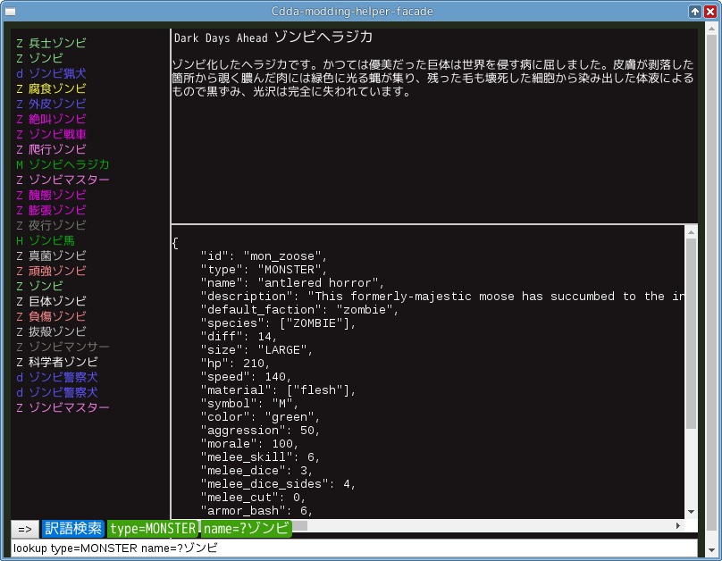
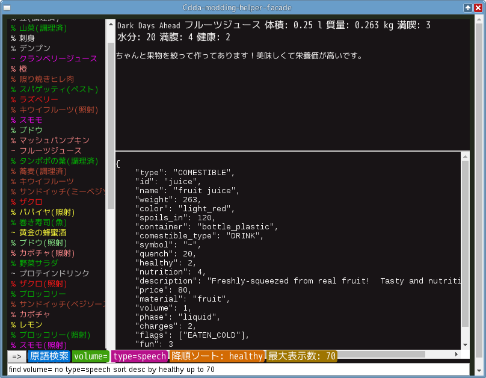

# cdda-modding-helper-facade  
Cataclysm DDA 向けの json ブラウザです  
cddaフォルダ以下にある全てのjsonから検索します  
mod別検索や日本語による検索が可能で、単純な情報以外に生のjson書式での表示も行えます  

json の生情報を併記するなどの特性上、スポイラーとしても機能します  
\*気をつけて\*使ってください   

要求するコンピュータ技能は 3〜4 くらいのつもり  

## ダウンロード
ダウンロード > [Releases](https://github.com/YueKaburagi/cdda-modding-helper-facade/releases)  
内部で [cdda-modding-helper](https://github.com/YueKaburagi/cdda-modding-helper) を使っているので
そっちもダウンロードしておいてください   

### 動作条件
↓のどれかで動くはず   
- Windows 7 以降 + Java 7 以降  
- MacOS 10.9 以降 + Java 7 以降  
- Electron 1.4.x が動作する環境 + Java 7 以降  

## 使い方
### 前準備
動作には
[cdda-modding-helper.jar](https://github.com/YueKaburagi/cdda-modding-helper)
があることと  
\_\_config.json に以下の記述があること  
```json
{
    "cdda_root": "Cataclysm:DDA のフォルダ位置",
    "po*path": "poファイルの場所"
}
```
が必要です   
*参照: [\_\_config.json](https://github.com/YueKaburagi/cdda-modding-helper/wiki/__config.json)*   
どちらも cdda-modding-helper-facade 本体と同じフォルダに置いてください  

### 遅い
起動直後や、広すぎる検索条件を投げた後など、結果が来るまで数秒反応が消えることがあります  
連打しても動作が遅くなるかおかしくなるかだけなので、返事が帰ってくるまで手近なゾンビでも屠っててください  

### 検索
マウスを下の方に持っていくと検索用のコンポーネントが下から生えてきます  
\[+\]ボタンで検索条件の追加ができます   

検索欄へ直接入力がしたいときは Tab キーを何回か押してフォーカスしてください  
検索欄では素直に入力した場合と   
find や lookup からはじまる helper 用の記法で入力した場合とで挙動が異なります  

helper 用の記法については
[ここ](https://github.com/YueKaburagi/cdda-modding-helper/wiki/Browser)
を参照してください


## ScreenShots


